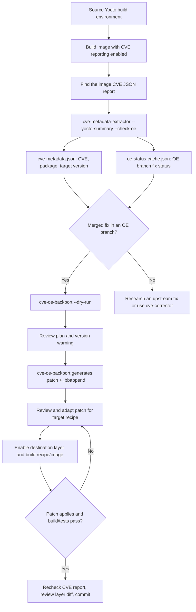

<!-- SPDX-License-Identifier: MIT -->
# From Yocto CVE report to reviewed backport

This guide assumes you have a working Yocto build, a destination layer for
your changes, and `yocto-security-tools` installed (for example,
`pip install -e .` from this repository). A **recipe** builds one package;
an **image** combines packages into a deployable system; a `.bbappend`
extends a recipe without editing its original layer.



## 1. Build and get a CVE report

Source your project's Yocto build environment (`oe-init-build-env` usually
changes your current directory to the build directory). Configure CVE
reporting for that build; on projects using the Yocto `cve-check` class, this
typically means adding `INHERIT += "cve-check"` to your build's
`conf/local.conf`. Then build your image:

```bash
source /path/to/yocto/oe-init-build-env /path/to/build
bitbake <image-name>
```

Find the resulting image-level CVE JSON report under your build's deploy
directory. Report filenames and locations vary with Yocto release and project
configuration; confirm the JSON contains a top-level `package` array with
recipe `name`, `version`, and `issue` entries before passing it to the tool.
For example, a project may produce `tmp/deploy/images/<machine>/cve-report.json`.
If it does not produce this report, consult your project's CVE reporting setup
before continuing.

## 2. Extract metadata and check OE

Choose paths for the report, metadata output, OE clone directory, and your
destination layer. Run from the tools repository or pass absolute paths:

```bash
REPORT=/path/to/build/tmp/deploy/images/<machine>/cve-report.json
METADATA=/path/to/cve-metadata.json
REPOS=/path/to/oe-repos
LAYER=/path/to/meta-cve-patches

cve-metadata-extractor --yocto-summary "$REPORT" --output "$METADATA" \
  --check-oe --oe-branch scarthgap --repo-dir "$REPOS"
```

Choose `--oe-branch` for the branch where you expect to find a fix. This can
be newer than your target build branch (for example, a scarthgap fix for a
kirkstone recipe). OE checks may clone public repositories under `REPOS` on
first use. `--oe-token` is optional: without it, Git branch checks work, but
mailing-list checks are skipped. The extractor creates `METADATA` with the
target package/version and `REPOS/oe-status-cache.json` with OE fix statuses.

The backport generator only considers `merged` cache entries. A cache result
of `not_found`, `submitted`, or `under review` is not a patch. If your Yocto
summary later marks a CVE patched, rerun extraction with the same output to
update its selection before generating more backports. `--cve-id` explicitly
selects a CVE even if the summary marks it patched; use that deliberately.

## 3. Prepare one CVE first

Inspect the CVE in the metadata and the status cache, then preview only the
package/CVE you intend to backport:

```bash
cve-oe-backport --repo-dir "$REPOS" --layer-dir "$LAYER" \
  --cve-info "$METADATA" --package avahi --cve-id CVE-2025-68276 --dry-run
```

Both filters are optional and repeatable; using both requires a match on both.
The generator uses **existing local OE clones**, not the Yocto build's source
checkout. A successful dry run does not create files. Inspect any warning
that the metadata (target) recipe version differs from the upstream recipe
version: the patch may need adaptation even though generation can continue.

When the plan is correct, run the same command without `--dry-run`. For a
matching upstream recipe path such as `recipes-connectivity/avahi/avahi_0.8.bb`,
the result in your layer looks like:

```text
meta-cve-patches/
  recipes-connectivity/avahi/
    avahi_0.8.bbappend
    cve-oe-backport/CVE-2025-68276.patch
```

The `.patch` contains the fix to the package's source, **not** the Git diff
that added the patch to an OE recipe. The `.bbappend` makes BitBake find and
apply it. Existing append content is preserved, with generated entries
marked by comments. Existing patches with different contents are not
overwritten; inspect a conflict instead of deleting or replacing files
blindly. An OE commit that does not contain a matching CVE patch is not
automatically converted into a source patch.

## 4. Validate before committing

Make sure the destination layer is enabled in your build (check with
`bitbake-layers show-layers`; add it with `bitbake-layers add-layer "$LAYER"`
if appropriate). Read the new `.patch` and `.bbappend`, confirm the patch
really addresses the CVE for your **target version**, and build the recipe:

```bash
bitbake <recipe-name>
bitbake <image-name>
```

If applying or building fails, adapt the generated patch to the target source
and rebuild. Run available recipe tests/ptest where applicable. Generate a
fresh CVE report and confirm the CVE status with your project's reporting
rules; a successful build alone does not prove the vulnerability is fixed.
Finally review the destination layer's diff and commit only the verified
recipe append and patches. The generator itself does not build, test, commit,
or remove previously generated files for CVEs that later become patched.

For fixes **without** a merged OE patch, see
[cve-corrector](cve-corrector.md) for a separate `devtool` workflow using an
upstream fix commit, and [cve-agent](cve-agent.md) for assisted recovery.